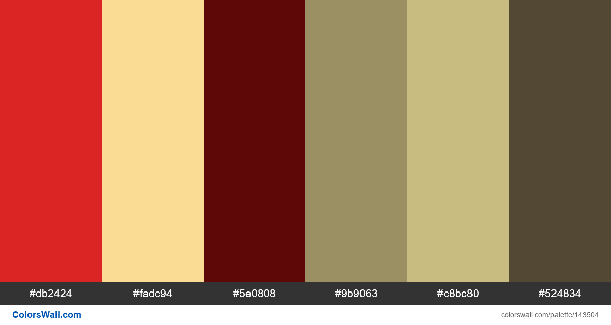
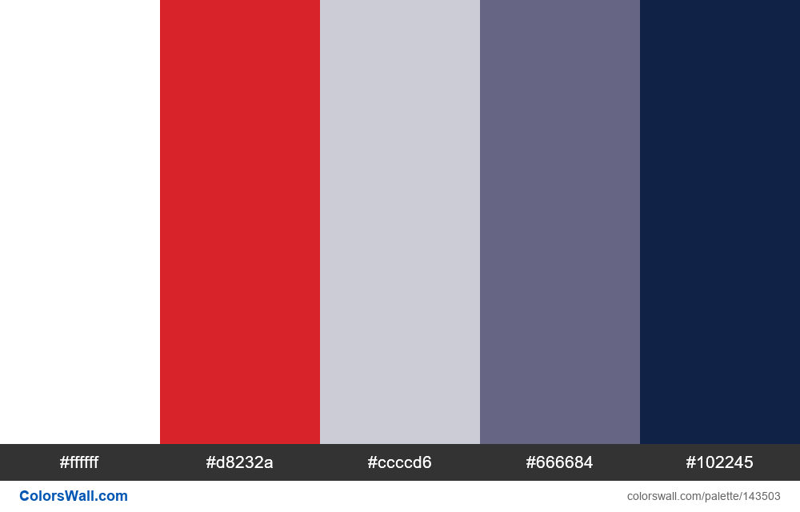

# Collor Palette

## Socialist Party Colors:

| HEX     | RGB                |
|---------|--------------------|
| #db2424 | rgb(219, 36, 36)   |
| #fadc94 | rgb(250, 220, 148) |
| #5e0808 | rgb(94, 8, 8)      |
| #9b9063 | rgb(155, 144, 99)  |
| #c8bc80 | rgb(200, 188, 128) |
| #524834 | rgb(82, 72, 52)    |

## Double Agents Colors:

| HEX     | RGB                |
|---------|--------------------|
| #ffffff | rgb(255, 255, 255) |
| #d8232a | rgb(216, 35, 42)   |
| #ccccd6 | rgb(204, 204, 214) |
| #666684 | rgb(102, 102, 132) |
| #102245 | rgb(16, 34, 69)    |
